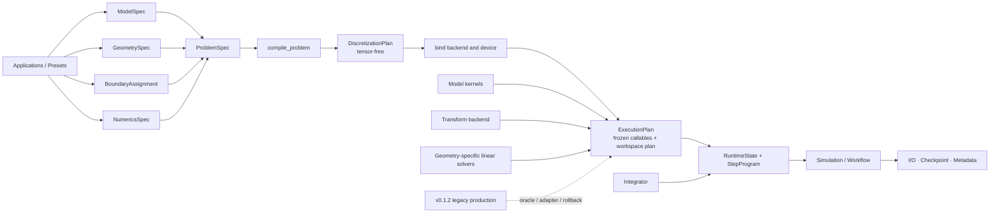

可以。综合检查现有代码、`v0.1.2` 的性能结果以及此前 Stage A–S 的架构实验后，我的核心判断是：

> PSSolver 现在并不缺少“新架构思想”，真正缺少的是：让声明式的新控制层，编译到 `v0.1.2` 已经优化好的高速执行路径中。

因此下一阶段不应推倒重写，也不应直接把较慢的 separated-canary 晋升为生产实现，而应逐步让“清晰架构”和“高性能数据路径”汇合。

## 一、首先明确 PSSolver 的定位

我建议把正式目标定义为：

> 面向平滑连续场、规则或可分离张量积几何的 GPU-first、spectral-first、多模型 PDE 求解框架。

近期正式支持范围：

- 几何：
  - Periodic box
  - Plane/slab
  - Rectangular channel
- 数学方法：
  - FFT
  - DCT/DST
  - 混合 tensor-product transforms
  - 对角谱算子
  - 每个模态的小型 block solver
  - 几何专用 Poisson/Stokes/Helmholtz solver
- 模型：
  - active nematics
  - diffusion/reaction–diffusion
  - phase field
  - incompressible/quasistatic flow
- 长期能力：
  - 多种时间积分器
  - 非齐次边界与 strong anchoring
  - stochastic dynamics
  - differentiable runtime 与 optimal control

暂时不把以下内容列入核心目标：

- 任意非结构网格；
- 通用 FEM；
- 激波或间断解；
- AMR；
- 任意复杂几何；
- 近期的 MPI/多 GPU；
- 通用 symbolic PDE parser。

“通用”应当意味着同一套结构能容纳多种模型、边界和规则几何，而不是试图覆盖所有 PDE。

## 二、当前架构的关键事实

当前生产路径实际上仍然是：

```text
Plane application
→ PlaneBerisEdwardsRunSpec
→ legacy runtime builder
→ SpectralSolver
→ PDEModel
→ Fields
→ transforms.py
→ Plane workflow
```

与此同时，仓库中已经存在另一套较清晰的声明式结构：

```text
ProblemSpec
→ SpectralPlan
→ algebraic dependency DAG
→ capability dispatch
→ separated runtime
```

后者数学上已经得到验证，但不能直接晋升生产，因为已有测量表明它在 R320 上：

- timestep 大约慢 `42.96%`；
- peak allocated memory 大约增加 `58.95%`；
- peak reserved memory 大约增加 `32.87%`。

这些证据记录在 [architecture_stage_o_closure.md](/home/fansenwei/Desktop/Develop/PSSolver_docs_version_evolution_v0_1_2/notes/architecture_stage_o_closure.md)。

所以正确方向是：

> 保留新架构的语义合同，但让它在构造阶段编译成扁平、低分配、直接调用的执行程序，并复用当前已经优化好的数据布局和 kernel。

不是让生产模拟在每个 timestep 中动态遍历大量对象、字符串和 DAG 节点。

## 三、建议的目标数据流



这里最重要的是分清四类对象。

### 1. `ProblemSpec`

表达科学问题：

- 模型；
- 参数；
- 几何；
- 边界；
- 网格；
- 数值离散语义。

它不包含 GPU tensor、workspace 或运行状态。

### 2. `DiscretizationPlan`

对应目前 `SpectralPlan` 的角色：

- 每个分量使用什么基；
- retained modes；
- derivative mapping；
- dealiasing；
- zero-mode policy；
- field layout；
- algebraic dependency；
- solver capability requirements。

它仍然应当是 tensor-free、immutable、可序列化和可审计的。

### 3. `ExecutionPlan`

绑定具体 device/backend 后生成：

- 波数 tensor；
- DCT/DST matrix 或 FFT executor；
- projector mask；
- workspace 规划；
- 选择好的 Stokes/Poisson solver；
- 直接 callable；
- 编译后的执行顺序。

所有 registry lookup、dispatch 和解析都必须在这里完成，不能留到 timestep 热循环中。

### 4. `RuntimeState`

唯一可变状态：

- evolved fields；
- physical/spectral 表示有效性；
- 当前时间和步数；
- 必要的持久 algebraic state；
- integrator history。

临时梯度、应力和 scratch tensor 属于 workspace，不属于长期 state。

## 四、正式模块边界

我建议保留现有目录名称，逐渐收敛到下面的逻辑结构，避免为“目录漂亮”制造大规模搬迁。

| 模块 | 应负责 | 不应负责 |
|---|---|---|
| `core` | tensor-free dataclass、Protocol、科学语义 | Torch、FFT、GPU、应用逻辑 |
| `models` | 字段声明、方程、本构、自由能、初态、diagnostics | 选择 DCT/DST、具体 Plane Stokes |
| `geometries` | 拓扑、坐标、metric、wall normal、周期性 | free-slip、anchoring、active force |
| `planning` | 将模型、几何和物理 BC lower 成谱计划 | 分配运行 tensor |
| `backends` | FFT/DCT/DST 的 CPU/GPU 数值执行 | nematic、free-slip 等物理概念 |
| `operators` | gradient、laplacian、divergence、projection | 完整物理模型 |
| `linear_solvers` | Poisson、Helmholtz、Stokes、block solve | active-nematic 本构 |
| `execution` | lowering、冻结执行顺序、workspace 调度 | 输出文件和实验目录 |
| `integrators` | Euler、SBDF2、CNAB2 等推进算法 | Plane、文件保存 |
| `runtime` | state、executor、生命周期和同步 | CLI 和用户参数解析 |
| `workflows` / `io` | run、restart、snapshot、metadata、checkpoint | PDE 方程计算 |
| `applications` / `presets` | 最终组合各种下层组件 | 被任何核心模块反向依赖 |
| `adapters` / `compatibility` | 历史 API、Nematics3D、legacy 适配 | 被新核心反向依赖 |

建议最终把 [transforms.py](/home/fansenwei/Desktop/Develop/PSSolver_docs_version_evolution_v0_1_2/pssolver/transforms.py) 拆成：

```text
backends/torch/tensor_product.py
backends/torch/bounded_dense.py
operators/spectral.py
operators/projection.py
linear_solvers/stokes/plane.py
```

但原来的 `pssolver.transforms` 暂时保留为 compatibility facade。

同样，[Field.py](/home/fansenwei/Desktop/Develop/PSSolver_docs_version_evolution_v0_1_2/pssolver/Field.py)、[PDEmodel.py](/home/fansenwei/Desktop/Develop/PSSolver_docs_version_evolution_v0_1_2/pssolver/PDEmodel.py)、`solver.py` 和 `integrator.py` 都不应立即删除。

## 五、必须严格执行的依赖规则

建议将这些规则写成自动化 AST import 测试：

1. `core` 只能依赖标准库。
2. `models` 不得导入具体 geometry、backend、workflow 或 application。
3. `geometries` 不得导入 active nematics。
4. `planning` 不得导入 Torch。
5. `backends` 不得出现模型物理概念。
6. `linear_solvers` 根据 geometry capability 和 boundary signature 分派。
7. `runtime` 不解析 CLI，也不手写用户配置。
8. `workflow` 不实现 PDE 方程。
9. 只有 `applications` 可以同时看到所有下层模块。
10. 正式生产路径不得导入 `pssolver.experimental`。
11. timestep 热循环中不得出现字符串字段查找、registry lookup、JSON parsing 或动态依赖解析。

## 六、模型、几何和边界必须彼此独立

推荐关系是：

```text
FieldDeclaration
+ GeometrySpec
+ BoundaryAssignment
→ planner
→ BoundFieldSpec / basis plan
```

这意味着：

- Beris–Edwards 模型声明 `Q`、速度、压力及其数学关系；
- Plane 几何声明一个有界轴和两个周期轴；
- BoundaryAssignment 声明 Q 是 Neumann、速度是 free-slip；
- planner 再决定对应使用 FFT、DCT、DST、lifting 或 tau。

因此：

- “Plane”不应自动等于 free-slip；
- “Q 模型”不应自动等于 Neumann；
- DCT/DST 是物理边界 lower 后的数值实现，不是边界条件本身。

未来 strong anchoring 也应沿用这条路径：

- 固定非零 Q：Dirichlet + lifting；
- Robin：Robin operator/eigenbasis 或 tau；
- finite anchoring：surface-energy closure；
- degenerate planar anchoring：明确的壁面自由能，而不是简单切换 DST。

## 七、状态和 GPU 执行原则

这是架构迁移能否保持性能的关键。

### 状态所有权

建议拆分现有 `Fields` 的职责：

```text
FieldLayout
    immutable 名称、角色、分量、slice、basis signature

RuntimeState
    evolved buffer、representation generation、clock

WorkspacePlan
    transient H、gradQ、stress、force 等 buffer

OperatorContext
    gradient、laplacian、divergence 等数学访问接口
```

规则：

- model kernel 不持有长期 field tensor；
- workflow 不直接修改 solver 内部 tensor；
- diagnostics 只读；
- transform backend 只持有不可变 plan resources；
- checkpoint 不保存可重建的 workspace；
- storage index 不成为长期公开 API。

### 性能原则

- 构造期完成全部解析；
- hot loop 使用固定 shape、dtype、buffer 和调用顺序；
- 同 basis signature 的字段批量变换；
- 避免每步 Python dict、字符串、`.item()` 和 CPU sync；
- `torch.compile` 继续用于较大的 pointwise islands；
- 不强求编译整个 FFT/DCT orchestration；
- reference executor 和 optimized executor共享同一个科学计划；
- functional/control executor可以和 in-place production executor不同，但必须共享数学合同。

## 八、配置与 provenance 也需要重新分层

当前大 RunSpec 混合了过多身份。建议拆分为：

```text
ProblemSpec          科学模型、参数、几何、边界
NumericsSpec         网格、基、dealias、dtype
IntegratorSpec       scheme、dt、refresh policy
ExecutionPolicy      device、compile、backend implementation
InitializationSpec   初态版本、seed、projection
OutputSpec           保存、diagnostics、checkpoint
RunRequest           本次运行步数和输出位置
```

同时 metadata 应明确区分：

1. scientific identity；
2. discretization identity；
3. execution identity；
4. run identity。

这样一次性能优化只改变 execution identity，不会伪装成物理模型变化。

各层应自己生成结构化 metadata，application 只组合，避免继续手写几百行容易过期的说明。

## 九、推荐的分阶段迁移

### Phase 0：架构冻结

仅做文档和静态测试，不改数值路径。

产物：

- architecture charter；
- dependency graph；
- public/private API 清单；
- state ownership ADR；
- model/geometry/boundary ADR；
- metadata/checkpoint compatibility policy；
- `v0.1.2` oracle 清单；
- AST dependency-boundary test。

这一步全部可以在本地完成。

### Phase 1：机械拆分 God modules

先拆 `transforms.py`，随后再拆 `Fields` 的逻辑职责。

要求：

- 原 import 继续工作；
- 操作顺序不变；
- 短轨迹 byte-identical；
- 完整 CPU 测试；
- 一次 H100 non-regression smoke。

这一阶段只移动所有权，不改变算法。

### Phase 2：配置身份拆分

把大 RunSpec 拆成多个组合 spec，同时保留原 `PlaneBerisEdwardsRunSpec` 作为兼容包装。

要求 dry-run、metadata 和现有 CLI 保持兼容。

### Phase 3：建立新 state/compiler，但先不替换 Plane

实现：

```text
ProblemSpec
→ DiscretizationPlan
→ ExecutionPlan
→ RuntimeState
→ StepProgram
```

先用于简单模型：

- periodic diffusion；
- mixed-BC diffusion；
- Allen–Cahn 或 Cahn–Hilliard。

这样可以验证框架通用性，而不立即承担完整 Beris–Edwards–Stokes 风险。

### Phase 4：加入第二个积分器和基础 block operator

在半隐式 Euler 之外增加 SBDF2 或 CNAB2，并完成时间收敛测试。

不要在这一步引入 symbolic DSL、Newton/Krylov 或任意变系数算子。

### Phase 5：Plane Beris–Edwards 新路径

关键原则：

> 新控制层，旧的高性能数据布局和 kernel。

不能直接移植现有 separated-canary 的逐组件动态执行方式。

新 Plane 路径先作为 opt-in：

```text
runtime = legacy_production
runtime = compiled_v2
```

默认仍然是 `legacy_production`。

### Phase 6：Plane 晋升门禁

单独完成：

- manufactured/equation-level tests；
- 100-step Q/u/p 比较；
- restart/checkpoint；
- metadata/output；
- R128/R320 H100 balanced A/B；
- 显存和 transform-call 比较；
- 长时间 benchmark；
- implicit-default smoke。

候选资格通过，不等于自动修改默认值。默认晋升必须是独立提交和独立决定。

### Phase 7：Channel 作为第二几何验收

Channel 可以共享：

- Beris–Edwards 本构；
- transform primitives；
- state/runtime；
- integrators。

但必须独立实现并验证：

- Channel Stokes/Schur solver；
- no-slip parity；
- pressure gauge；
- wall modes；
- 性能和显存。

Plane 的验证不能自动覆盖 Channel。

### Phase 8：非齐次边界与 strong anchoring

顺序建议：

1. lower/upper face 独立 BC；
2. nonzero Dirichlet lifting；
3. Robin/tau；
4. fixed strong anchoring；
5. surface-energy anchoring；
6. degenerate planar anchoring。

### Phase 9：control 与 differentiable runtime

等 state、plan 和 runtime 稳定后再加入：

- functional step；
- explicit controls；
- deterministic replay；
- checkpointing；
- autograd/adjoint；
- optimal-control workflow。

## 十、版本路线

建议把版本能力理解为里程碑，而不是强制时间表：

- `v0.1.2`：永久冻结的高速 Plane oracle；
- `v0.2.0`：模块边界、组合 API、配置拆分、scalar compiled runtime；Plane 默认不变；
- `v0.3.0`：至少两个模型、第二积分器、第一项非齐次 BC；
- `v0.4.0`：Plane compiled runtime 成为经过资格验证的 opt-in 路径；
- 后续 minor：Channel parity、strong anchoring、control；
- `v1.0`：公共 API、checkpoint 和 metadata schema 稳定后，才讨论移除历史 facade。

## 十一、现在应冻结与应延后的决定

现在应冻结：

- PSSolver 的适用范围；
- 单一内部 Q convention；
- model/geometry/boundary 分离；
- immutable plan + mutable state；
- reference/optimized executor共享同一科学计划；
- geometry-specific solver 是正式设计，不是例外；
- `v0.1.2 legacy_production` 是迁移 oracle；
- 不允许静默 fallback；
- scientific/discretization/execution/run identity 分离。

现在不要冻结：

- symbolic DSL；
- 第三方 plugin ABI；
- JAX/CuPy 通用 backend；
- 任意几何接口；
- MPI/multi-GPU；
- field 的永久 storage order；
- checkpoint 的永久二进制格式；
- 自动算法 tuner；
- 通用 Newton/Krylov；
- strong anchoring 的最终 public API；
- control 的最终用户 API。

至少应有两个真实消费者后，才把接口提升为稳定 public API。

## 十二、我建议的实际下一步

先不要写新 runtime，也不要碰 Plane 热路径。先建立一个独立的 `next/pssolver-v0.2.0-architecture` 分支，完成 Phase 0：

1. 写 architecture charter；
2. 写 4–6 个 ADR；
3. 记录当前 public/private API；
4. 增加 import dependency 测试；
5. 冻结 `v0.1.2` 数值与性能 oracle；
6. 明确 Phase 1 的逐文件搬迁顺序。

完成后，第一次代码改动只做 `transforms.py` 的机械拆分，并用兼容 facade 保持所有现有 import 和数值路径不变。

这条路线能够同时保住三件最重要的东西：

- `v0.1.2` 已经取得的 GPU 性能；
- benchmark 的科学可信度；
- 未来扩展模型、几何、边界和 control 所需的清晰架构。
